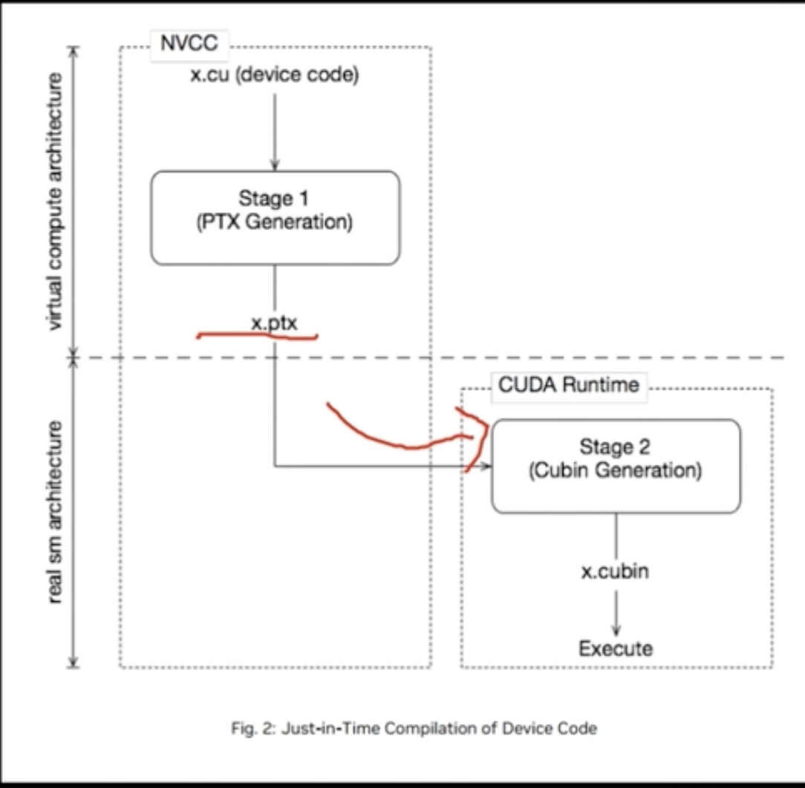

## Version of ASM and Compute

When working with CUDA, it's important to be aware of the versions of ASM (Assembly) and Compute capabilities your hardware supports. These versions can impact the performance and compatibility of your CUDA applications.

### Checking Compute Capability

You can check the compute capability of your GPU by using the `deviceQuery` sample provided in the CUDA Toolkit. This will give you detailed information about your GPU, including its compute capability.

### ASM Version

The ASM version corresponds to the assembly language version supported by the CUDA compiler. This version is typically tied to the compute capability of your GPU. You can find more information about the supported ASM versions in the CUDA documentation.

### Example

For example, a GPU with compute capability 7.5 supports ASM version 7.5. This means you can use features and instructions available in ASM 7.5 when writing CUDA kernels.

### References

- [CUDA Compute Capability](https://developer.nvidia.com/cuda-gpus)
- [CUDA Toolkit Documentation](https://docs.nvidia.com/cuda/cuda-toolkit-release-notes/index.html)

Make sure to always refer to the latest CUDA documentation for the most accurate and up-to-date information.

### Compile Command

To compile a CUDA program, you can use the `nvcc` compiler provided by the CUDA Toolkit. Here are example commands to compile a CUDA program with different ASM and Compute capabilities:

For compute capability 7.5:
```sh
nvcc -arch=compute_75 -code=sm_75 -o my_program_75 my_program.cu
```

For compute capability 8.0:
```sh
nvcc -arch=compute_80 -code=sm_80 -o my_program_80 my_program.cu
```

In these commands:
- `-arch=compute_75` and `-arch=compute_80` specify the compute capability.
- `-code=sm_75` and `-code=sm_80` specify the target architecture.
- `-o my_program_75` and `-o my_program_80` specify the output file names.
- `my_program.cu` is the input CUDA source file.

Make sure to adjust the compute capability and target architecture according to your GPU's specifications.
 
### Compiling for Multiple Architectures

You can compile your CUDA program for multiple architectures and ASM versions simultaneously by specifying multiple `-arch` and `-code` flags in the `nvcc` command. This is useful if you want your program to be compatible with different GPU architectures.

For example, to compile for both compute capability 7.5 and 8.0, you can use the following command:
```sh
nvcc -gencode -arch=compute_75 -code=sm_75 -gencode -arch=compute_80 -code=sm_80 -o my_program_multi my_program.cu
```
You can simplifiy it as
```sh 
nvcc -gencode arch=sm_80 demo.cu demo
# equals to 
nvcc -gencode arch=compute_80 -code=sm_80 demo.cu demo
```
In this command:
- `-arch=compute_75` and `-arch=compute_80` specify the compute capabilities.
- `-code=sm_75` and `-code=sm_80` specify the target architectures.
- `-o my_program_multi` specifies the output file name.
- `my_program.cu` is the input CUDA source file.

This will generate a single executable that supports both compute capability 7.5 and 8.0, making your program more versatile and compatible with a wider range of GPUs.

The process of compilation


## You can also use default compute cap via -ptx
`-ptx` can make nvcc use the default compute.
```sh
nvcc demo.cu demo -ptx
```