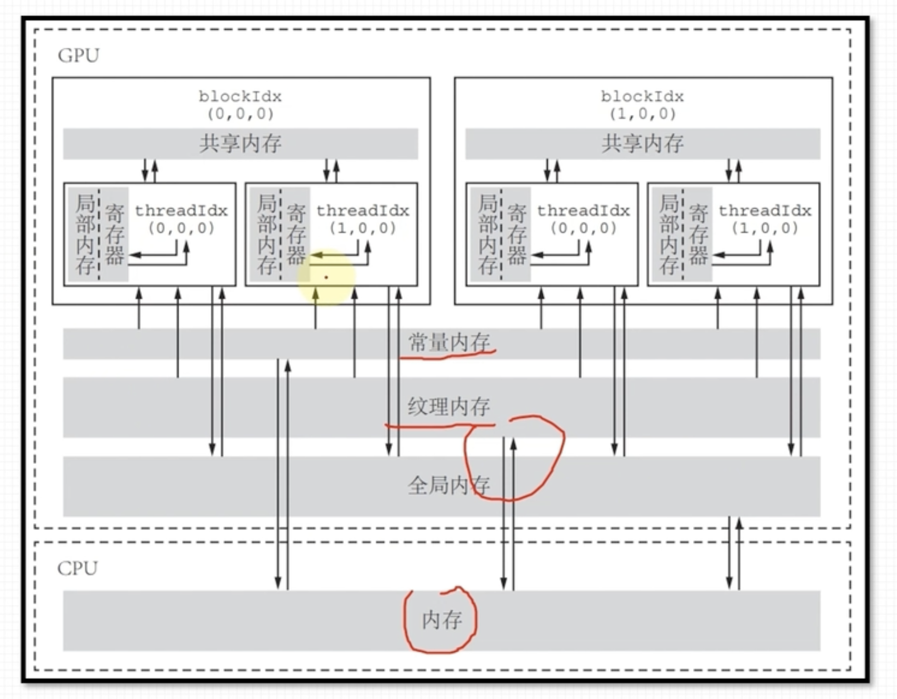
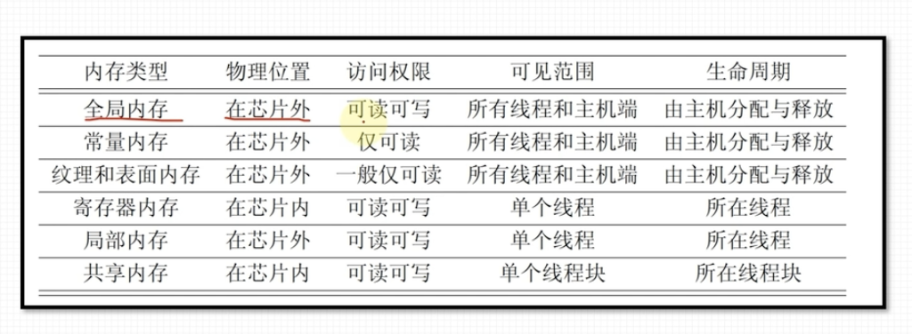

## Introduction of the Streaming Multiprocessor and Single Instruction Multiple Threads

In CUDA, the Streaming Multiprocessor (SM) is the fundamental unit of execution. Each SM is capable of executing multiple threads in parallel, following the Single Instruction Multiple Threads (SIMT) architecture. This means that a single instruction is issued to multiple threads simultaneously, allowing for efficient parallel processing.

### Key Features of Streaming Multiprocessors:
- **Warp Scheduling**: Threads are grouped into warps, typically consisting of 32 threads. The SM schedules and executes these warps in parallel.
- **Shared Memory**: Each SM has a shared memory space that can be accessed by all threads within the SM, enabling fast data sharing and synchronization.
- **Registers**: Each SM has a set of registers that are allocated to threads for storing intermediate data during execution.
- **Execution Units**: SMs contain multiple execution units that perform arithmetic and logic operations, memory accesses, and other instructions.

### Benefits of SIMT Architecture:
- **Scalability**: The SIMT architecture allows for scalable parallelism, making it suitable for a wide range of applications, from scientific computing to machine learning.
- **Efficiency**: By issuing a single instruction to multiple threads, the SIMT architecture reduces the overhead of instruction decoding and scheduling, leading to more efficient execution.

Understanding the role of the Streaming Multiprocessor and the SIMT architecture is crucial for optimizing CUDA applications and achieving high performance on NVIDIA GPUs.

## Introduction of the Thread Warp
In CUDA, a warp is a group of 32 threads that are executed simultaneously by a Streaming Multiprocessor (SM). Warps are the basic unit of execution in the SIMT architecture, and understanding how they work is essential for writing efficient CUDA programs.

### Key Concepts of Thread Warps:
- **Warp Size**: A warp consists of 32 threads. This size is fixed and is a fundamental aspect of the CUDA architecture.
- **Warp Divergence**: When threads within a warp follow different execution paths (e.g., due to conditional statements), warp divergence occurs. This can lead to reduced performance, as the SM must serialize the execution of different paths.
- **Warp Scheduling**: The SM schedules warps for execution. If one warp is stalled (e.g., waiting for memory access), the SM can switch to another warp, helping to hide latencies and keep the execution units busy.

### Best Practices for Warp Management:
- **Minimize Divergence**: To avoid performance penalties, try to minimize warp divergence by ensuring that threads within a warp follow the same execution path as much as possible.
- **Memory Coalescing**: Arrange memory accesses so that threads within a warp access contiguous memory locations. This can improve memory access efficiency and overall performance.
- **Occupancy**: Maximize the number of active warps on an SM to ensure high occupancy. This can help to hide latencies and improve throughput.

By understanding and effectively managing thread warps, developers can optimize their CUDA applications for better performance on NVIDIA GPUs.

To maximize the GPU using, we set the number of thread block as 32*k, k is int. 

## memory model in GPU, with figures.
### Memory Model in GPU

In CUDA, the memory model is hierarchical and consists of several types of memory, each with different characteristics and access patterns. Understanding these memory types is crucial for optimizing memory access and achieving high performance.

#### Types of Memory:
- **Global Memory**: This is the largest memory space available on the GPU, accessible by all threads. However, it has high latency and lower bandwidth compared to other memory types.
- **Shared Memory**: This is a small, fast memory space shared among threads within the same block. It is useful for data sharing and synchronization among threads.
- **Local Memory**: This is private to each thread and is used for storing local variables. It resides in the global memory space and has similar latency characteristics.
- **Constant Memory**: This is a read-only memory space cached on the GPU. It is optimized for broadcast access where multiple threads read the same location.
- **Texture Memory**: This is a read-only memory space optimized for 2D spatial locality, often used in graphics and image processing applications.

#### Memory Access Patterns:
- **Coalesced Access**: When threads in a warp access contiguous memory locations, the accesses can be coalesced into a single transaction, improving memory bandwidth utilization.
- **Bank Conflicts**: In shared memory, bank conflicts occur when multiple threads access different addresses within the same memory bank, leading to serialization of accesses. Properly structuring memory accesses can help avoid bank conflicts.

By understanding the GPU memory model and optimizing memory access patterns, developers can significantly improve the performance of their CUDA applications.
